<h1 align="center">Selam, ben Hüseyin 👋</h1>

  

---

### 📊 GitHub Metriklerim

  

<table align="center">
  <tr>
    <td align="center"><b>📅 Yıllık Commit Takvimi</b></td>
    <td align="center"><b>🈷️ Kullandığım Diller</b></td>
  </tr>
  <tr>
    <td></td>
    <td></td>
  </tr>
  <tr>
    <td align="center"><b>💡 Kodlama Alışkanlıklarım</b></td>
    <td align="center"><b>🏆 Başarılarım</b></td>
  </tr>
  <tr>
    <td></td>
    <td></td>
  </tr>
  <tr>
    <td align="center"><b>🎟️ Issues & PR Takibi</b></td>
    <td align="center"><b>💻 Terminal Görünüm</b></td>
  </tr>
  <tr>
    <td></td>
    <td></td>
  </tr>
</table>

---

### 🔗 Bana Ulaşın

  

