<!-- ===================== BANNER ===================== -->
<a href="https://github.com/huseyinelmuhaammed">
  
</a>

<!-- ===================== TYPING ===================== -->
<p align="center">
  <a href="https://github.com/huseyinelmuhaammed">
    
  </a>
</p>

<!-- ===================== PROFILE VIEWS ===================== -->
<p align="center">
  
  <a href="https://github.com/huseyinelmuhaammed?tab=followers">
    
  </a>
</p>

<br>

<!-- ===================== HAKKIMDA ===================== -->
##  Hakkımda

```yaml
👤 İsim:      Hüseyin Elmuhammed
🔭 Şu an:     Yazılım geliştirme üzerine çalışıyorum
🌱 Öğreniyorum: Modern web & mobile teknolojileri
💼 İlgi:      Backend, Mobile, Open Source
⚡ Motto:     "Kod yazmak sanattır, çalışan kod ise mucize."
```

<br>

<!-- ===================== TECH STACK ===================== -->
##  Tech Stack

<p align="center">
  <a href="https://skillicons.dev">
    
    <br>
    
  </a>
</p>

<br>

<!-- ===================== GITHUB STATS ===================== -->
##  GitHub İstatistikleri

<p align="center">
  <a href="https://github.com/huseyinelmuhaammed">
    
    
  </a>
</p>

<p align="center">
  <a href="https://github.com/huseyinelmuhaammed">
    
  </a>
</p>

<br>

<!-- ===================== TROPHY ===================== -->
##  Trophy Vitrini

<p align="center">
  <a href="https://github.com/ryo-ma/github-profile-trophy">
    
  </a>
</p>

<br>

<!-- ===================== ACTIVITY GRAPH ===================== -->
##  Aktivite Grafiği

<p align="center">
  
</p>

<br>

<!-- ===================== SNAKE ===================== -->
## 🐍 Contribution Snake

<p align="center">
  
</p>

<br>

<!-- ===================== METRICS ===================== -->
##  Detaylı Metrikler

<table align="center">
  <tr>
    <td align="center"><b>📅 Yıllık 3D Commit Takvimi</b></td>
    <td align="center"><b>🌇 Skyline — 3D Aktivite</b></td>
  </tr>
  <tr>
    <td></td>
    <td></td>
  </tr>
  <tr>
    <td align="center"><b>📌 İlgi Alanlarım</b></td>
    <td align="center"><b>🎟️ Issues & PR Takibi</b></td>
  </tr>
  <tr>
    <td></td>
    <td></td>
  </tr>
</table>

<details>
  <summary><b>🖥️ Terminal Görünüm — tıkla ve aç</b></summary>
  <p align="center">
    
  </p>
</details>

<br>

<!-- ===================== SOCIAL ===================== -->
##  Bana Ulaşın

<p align="center">
  <a href="https://github.com/huseyinelmuhaammed">
    
  </a>
  <a href="mailto:huseyin.ayataa@gmail.com">
    
  </a>
  <a href="https://www.linkedin.com/">
    
  </a>
  <a href="https://twitter.com/">
    
  </a>
</p>

<br>

<!-- ===================== QUOTE ===================== -->
<p align="center">
  
</p>

<!-- ===================== FOOTER ===================== -->

